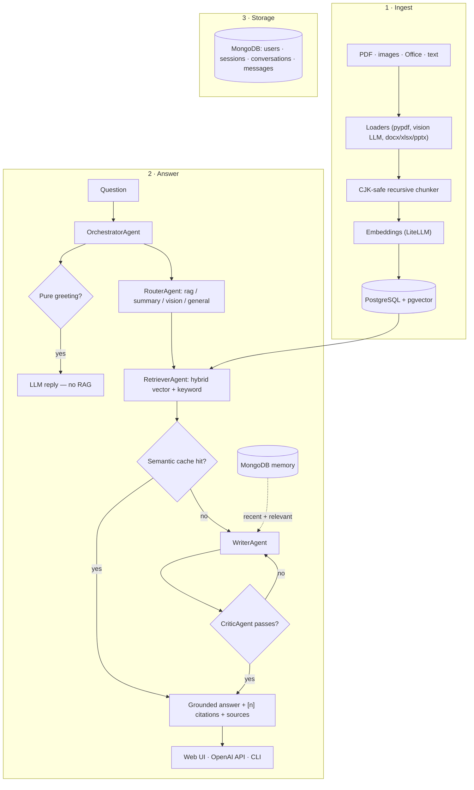
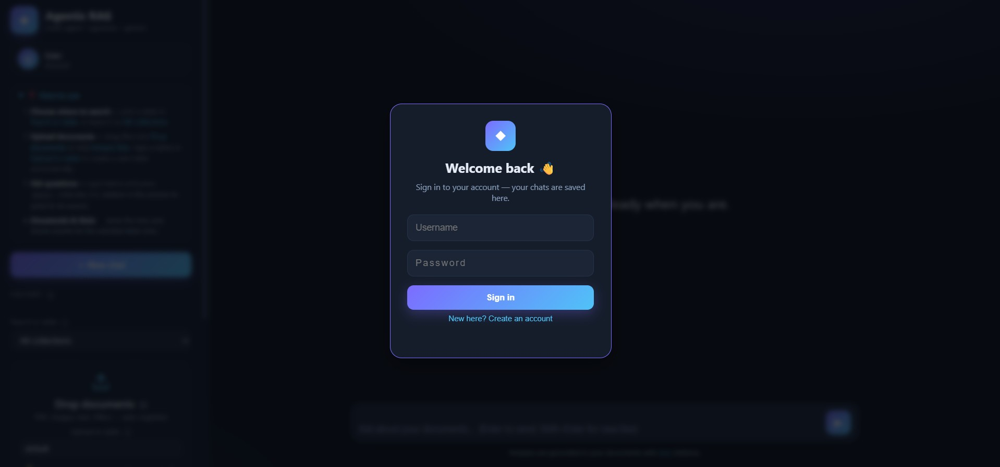
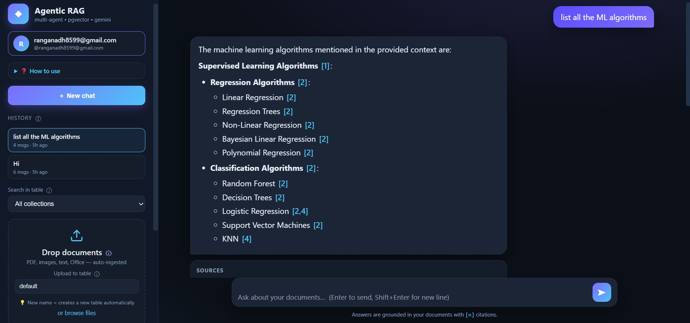

# Agentic RAG

A **multi-agent RAG system** that reads **PDFs and images**, stores everything in
**PostgreSQL (pgvector)**, and answers questions with **any LLM provider**
(OpenAI, Gemini, Claude, local Ollama, ...) through one unified interface.

## 🏗️ Architecture

Two pipelines — **ingest** and **answer** — backed by two stores: **PostgreSQL +
pgvector** for documents and vectors, and **MongoDB** for users & chat history.



**Answer pipeline (per question):**

1. **Greeting short-circuit** — pure greetings are answered directly by the
   LLM, skipping RAG entirely (no embedding, retrieval, or citations).
2. **Router** — classifies the query as `rag`, `summary`, `vision`, or `general`.
3. **Retriever** — hybrid retrieval (vector + Postgres full-text keyword) with
   LLM query expansion and reciprocal-rank fusion, scoped to the selected
   collection; consults the semantic cache first.
4. **Writer** — generates a grounded answer with `[n]` citations from the
   retrieved blocks, enriched with "recent + relevant" conversation memory.
5. **Critic** — verifies factual grounding and citation integrity; if issues
   are found, the Writer retries with feedback (up to `MAX_CRITIC_ROUNDS`, default 2).
6. **Post-processor** — `sanitize_citations` deterministically drops
   out-of-range or "padding" citations, expands ranges, and dedupes; source-card
   snippets are centered on the cited claim.

Everything is provider-agnostic: all LLM and embedding calls go through
**LiteLLM**, so switching OpenAI ↔ Gemini ↔ Anthropic ↔ Ollama (or the offline
`mock`) is a one-line env-var change.

## ✨ Capabilities

- **Ingest almost anything** — PDFs (per-page text + embedded images),
  standalone images (via a vision LLM), text/Markdown/CSV/JSON, Word, Excel,
  and PowerPoint.
- **Answer with evidence** — every claim is grounded in your documents with
  clickable `[n]` citations, source cards, and the actual chart/diagram image.
- **Any LLM provider** — OpenAI, Gemini, Anthropic, local Ollama, or an offline
  `mock` — switchable with one env var (via LiteLLM).
- **Multi-user & history** — real username/password auth (PBKDF2) with per-user
  persisted chat history in MongoDB.
- **Dataset isolation** — named *collections* keep different datasets (resume,
  hr, finance, ...) from ever mixing.
- **Fast answers** — semantic cache for repeated queries, greeting
  short-circuit, and query-embedding caching.
- **Developer friendly** — OpenAI-compatible API (`/v1/chat/completions`),
  web UI, and a CLI, all backed by an 87-case end-to-end test suite.

## Features

### 🤖 LLM & providers

- **Multi-provider LLM + embeddings** via [LiteLLM](https://github.com/BerriAI/litellm)
  — switch providers by changing one env var (`openai/*`, `gemini/*`,
  `anthropic/*`, `ollama/*`, ...). A `mock` provider works offline with no keys.
- **OpenAI-compatible API** — `POST /v1/chat/completions` (stream + non-stream)
  so any OpenAI client can talk to it.

### 📄 Ingestion & documents

- **PDF + image + Office ingestion** — `pypdf` text extraction per page, embedded images
  summarized by a **vision LLM**, standalone images read via vision models, plain
  text/markdown, plus **Word (.docx), Excel (.xlsx), and PowerPoint (.pptx)**.
- **Source images in the UI** — images extracted from documents are stored and shown
  as thumbnails next to the sources they're cited with (`/images/{id}`), so you can see
  the actual chart/diagram that backs an answer (click to open full size).
- **Robust ingestion & API** — unsupported file types return `415`, corrupt/empty
  files return `400` with a clear message (no more `500`s), empty chat messages
  return `400`, and empty files are reported as `"no extractable content"` instead
  of a misleading "skipped".

### 🔎 Retrieval & memory

- **Hybrid retrieval** — vector search + Postgres full-text keyword search,
  **LLM query expansion**, and **reciprocal-rank fusion**.
- **Semantic cache** — repeated queries answered instantly when a semantically
  similar cached answer exists (cosine ≥ 0.90).
- **Conversation memory** — "recent + relevant" context injection per chat.
- **Greeting short-circuit** — pure greetings (hi/hello/hey/what's up/good
  morning…) are detected instantly and answered directly from the LLM, **skipping
  RAG entirely** (no embedding, no retrieval, no citations) for a fast, friendly
  reply. Greetings with a real question (e.g. "hi, what is in the report?") still
  run RAG.
- **General-knowledge fallback** — if retrieval finds no *strong* match (top
  vector cosine below `GENERAL_STRONG_THRESHOLD`, default 0.72) and the router
  says the question is general, it answers from general knowledge with **no
  fabricated citations** (e.g. "capital of France → Paris"). Doc questions that
  fail retrieval still refuse honestly rather than hallucinate.
- **File-name aware retrieval** — a query that names a document
  ("describe chart.png", "what is in report.pdf?") always surfaces that document
  via an exact title match promoted to the top, even when its chunks are OCR noise.

### 🧠 Multi-agent & citation integrity

- **Multi-agent orchestration** — Router → Retriever → Writer → Critic
  (hallucination check) with a feedback loop, grounded answers with `[n]`
  citations, and live streaming.
- **Citation integrity (robust)** — a three-layer guard keeps citations honest:
  1. the **Writer prompt** forbids "padding" citations (only cite a block that
     literally contains the claim) and prefers the fewest citations per claim;
  2. the **Critic** verifies both factual grounding *and* that each `[n]` maps to
     a block that supports the claim it is attached to;
  3. a deterministic **post-processor** (`sanitize_citations`) drops out-of-range
     `[n]`, expands `[1-3]` ranges, dedupes, and prunes multi-citation groups whose
     chunk has no lexical overlap with the surrounding claim (always keeping the
     best-matching one).
  Source-card snippets are also **centered on the cited claim** (dense window of
  the chunk that overlaps the answer), instead of showing the raw chunk start.

### 🗄️ Storage

- **PostgreSQL storage** — `documents`, `chunks`, `conversations`, `messages`,
  and `semantic_cache` tables. Uses **pgvector** (HNSW indexes) when available,
  with an automatic JSONB + Python-cosine fallback.
- **pgvector HNSW (halfvec)** — embedding columns over 2000 dims (e.g.
  gemini-embedding-2 at 3072) are stored as `halfvec` so HNSW approximate indexes
  work (pgvector's `vector` HNSW caps at 2000 dims). `init_db()` migrates existing
  columns automatically; without this, every search was a full scan.
- **Collections (table isolation)** — documents live in named *collections*
  (Postgres tables/namespaces). Pick a table to search **only that table's**
  sources, upload into a table name (auto-created on first file), and keep
  different datasets (resume, hr, finance, ibm, ...) from ever overlapping.
  Dedup, retrieval, and the semantic cache are all scoped per collection.

### 👤 Users & UX

- **Users & persisted chat history (in MongoDB)** — accounts
  and every conversation/message are stored in **MongoDB** (`users`, `sessions`,
  `conversations`, `messages` collections) with a **real username + password
  login** (PBKDF2-hashed passwords, no OAuth). Each conversation is stored
  per-user and can be resumed from the **History pane** (title, message count,
  relative time, delete). The user's message is saved the moment they send it, so
  nothing is lost even if a stream is interrupted. Sessions use opaque bearer
  tokens with a 30-day TTL, and cross-user isolation is enforced server-side
  (`401` without a token, `403` for another user's chat).

## Quick start

```bash
# 1. Install
cd \agentic-rag
python -m venv .venv
.\.venv\Scripts\Activate.ps1
pip install -r requirements.txt

# 2. Configure (copy .env.example -> .env). Works out-of-the-box with "mock".
#    To use real AI, set e.g.:
#      EMBEDDING_MODEL=openai/text-embedding-3-small
#      LLM_MODEL=openai/gpt-4o-mini
#      VISION_MODEL=openai/gpt-4o-mini
#      OPENAI_API_KEY=sk-...

# 3. Ingest documents
python cli.py ingest C:\path\to\a.pdf
python cli.py ingest C:\path\to\folder_of_docs     # whole directory
python cli.py ingest C:\path\to\a.pdf --collection hr   # into the 'hr' table

# 4. Ask questions
python cli.py ask "What is the revenue mentioned in the report?"
python cli.py ask "..." --collection hr                  # search only the 'hr' table
python cli.py chat                                        # interactive chat

# 5. Start MongoDB (users + chat history)
#    Portable install: extract https://fastdl.mongodb.org/windows/mongodb-windows-x86_64-8.3.8.zip to C:\mongodb
C:\mongodb\mongodb-win32-x86_64-windows-8.3.8\bin\mongod.exe --dbpath C:\mongodb\data --port 27017 --bind_ip 127.0.0.1
#    NOTE: mongod is a manual background process (not a service) — start it again after a reboot.

# 6. Run the API server
uvicorn api:app --reload --port 8000
curl -X POST http://localhost:8000/v1/chat/completions \
  -H "Content-Type: application/json" \
  -d '{"messages":[{"role":"user","content":"Summarize the PDF"}],"stream":true}'
```

## Web UI

Open **http://localhost:8000** in your browser. The built-in UI lets you:

- **Chat** with your documents (live streaming + grounded `[n]` citations)
- **Drag & drop** PDFs, images, and text files to ingest them instantly
- **Search in table** — a dropdown that scopes every search to one collection
  (or "All collections"); the document list and stats follow the selection
- **Upload to table** — type any table name before uploading; a new table is
  created automatically on first file, so datasets never mix
- See the ingested **document list** and **stats** in the sidebar
- Start a **new chat** (per-chat memory is preserved automatically)

## Screenshots

*Sign in or create an account to save, resume, and delete your chat history.*


*The chat interface — ask questions and get grounded answers with live
Markdown formatting, clickable `[n]` citations, and source cards, while the
sidebar shows collections, your documents, and stats.*


## Schema

**PostgreSQL (vectors & documents):**

| Table | Purpose |
|-------|---------|
| `collections` | named tables/namespaces; each document, chunk, and cache row belongs to one |
| `documents` | one row per ingested file (title, type, path, metadata, `collection_id`) |
| `chunks` | chunked content with embeddings (vector or jsonb), `collection_id` |
| `semantic_cache` | query→answer cache with embeddings (cosine threshold), `collection_id` |

**MongoDB (users & chat history):**

| Collection | Purpose |
|-------|---------|
| `users` | accounts — `username` (unique) + `display_name` + PBKDF2 `password_hash` |
| `sessions` | login tokens (opaque bearer tokens, 30-day TTL via Mongo TTL index) |
| `conversations` | chat sessions (`title` + `user_id`; deleting cascades to messages) |
| `messages` | per-turn messages (`conversation_id` + embeddings for semantic memory) |

Existing documents are backfilled into a `default` collection, so nothing breaks
for previously ingested files.

> **Collections API** — `GET /collections` lists tables with doc/chunk counts;
> `POST /collections` creates one. Ingest accepts `collection` (form field), the
> chat API accepts `collection` (JSON field), and `GET /documents?collection=`
> filters the document list.
>
> **Users & history API (real auth)** —
> - `POST /api/register` `{username, password, display_name}` — create an account
>   (`409` if the username is taken).
> - `POST /api/login` `{username, password}` — returns `{token, user}`.
> - `POST /api/logout` — invalidates the current token.
> - `GET /api/me` — validates a token, returns the user.
> - `POST /api/password` `{current_password, new_password}` (Bearer token) —
>   change the signed-in user's password (verifies the current one first,
>   `400` on a wrong current password or a too-short new one; revokes all other
>   sessions). In the UI this is under the account chip → **Reset password**
>   with **Update/Cancel** buttons.
> - `GET /conversations` (Bearer token) — lists the signed-in user's chats.
> - `GET/DELETE /conversations/{id}` (Bearer token) — fetch/delete a chat;
>   ownership enforced → `401` without a token, `403` for another user's chat.
> The chat API (`/v1/chat/completions`) is optional-auth: it accepts an
> `Authorization: Bearer <token>` header, and when present scopes conversation
> creation/resumption to that user (anonymous chats still work without one).
> Passwords are stored as PBKDF2-SHA256 hashes (never plaintext).

## Configuration (.env)

All tunables live in `config.py` and are loaded from environment variables
(see `.env.example` for the full annotated list). Core knobs: `EMBEDDING_MODEL`,
`LLM_MODEL`, `VISION_MODEL`, `USE_ASYMMETRIC_PREFIX`, `CHUNK_SIZE`, `CHUNK_OVERLAP`,
`TOP_K`, `USE_QUERY_EXPANSION`, `SEMANTIC_CACHE_THRESHOLD`, `RELEVANCE_FLOOR`,
`GENERAL_STRONG_THRESHOLD`. MongoDB knobs: `MONGO_URI` (`mongodb://127.0.0.1:27017`),
`MONGO_DB` (`agentic_rag`), `SESSION_TTL_SECONDS` (2592000 = 30 days).

Also configurable (defaults shown): `MAX_CRITIC_ROUNDS` (2), `ROUTER_MAX_TOKENS`
(100), `CRITIC_MAX_TOKENS` (300), `CITATION_OVERLAP_THRESHOLD` (0.25),
`SNIPPET_MAX_CHARS` (220), `SNIPPET_WINDOW` (40), `QUERY_EMBED_CACHE_SIZE` (256),
`KEYWORD_TITLE_BOOST` (2.0), `FILENAME_MATCH_SCORE` (3.0), `RETRIEVAL_MULTIPLIER`
(2), `STRUCTURED_KEYWORDS` (comma-separated resume/form names), `EMBED_BATCH_SIZE`
(32), `MEMORY_RECENT_K` (8), `MEMORY_RELEVANT_K` (4), `IMAGE_JPEG_QUALITY` (85),
`VISION_SUMMARY_MAX_TOKENS` (500), `HNSW_VECTOR_DIM_LIMIT` (2000).

**Upload limits** (`0` = unlimited): `MAX_UPLOAD_MB` (max size of a single
uploaded file, enforced server-side with `413` and pre-checked in the UI),
`MAX_UPLOAD_FILES` (max files accepted per batch/selection, extra files are
skipped with a notice). Files are uploaded one at a time (sequentially) with
live per-file progress. The UI reads these from `GET /api/config`.

> **Auto-chunking for short structured docs:** resumes, CVs, forms, and other
> short section-based documents (under `STRUCTURED_MAX_CHARS`, default 5000, or
> with a resume/cv/form-like filename) are automatically chunked with **larger
> chunks** (`STRUCTURED_CHUNK_SIZE`, default 2500) so their sections stay intact.
> This prevents the model from misreading fragmented content (e.g. mistaking
> education dates for employment).
>
> **Chunking defaults:** `CHUNK_SIZE=1500`, `CHUNK_OVERLAP=100`. Includes a
> **query-embedding cache** (repeated queries never re-embed) and a **relevance
> floor** on vector results.

> **Asymmetric prefixes**: enable `USE_ASYMMETRIC_PREFIX=1` only for local
> sentence-transformers embeddings (bge / nomic / all-MiniLM). Leave OFF for
> OpenAI/Gemini API embeddings.

## Project layout

```
agentic-rag/
├── config.py      # env-driven settings
├── db.py          # Postgres + pgvector schema and vector helpers
├── mongo.py       # MongoDB users, sessions, conversations, messages
├── llm.py         # unified multi-provider LLM + embeddings (with mock)
├── chunking.py    # CJK-safe recursive chunker
├── loaders.py     # PDF / image (vision) / text loaders
├── ingest.py      # ingestion pipeline
├── retrieval.py   # hybrid retrieval + semantic cache + RRF
├── memory.py      # conversation memory (recent + relevant)
├── agents.py      # Router / Retriever / Writer / Critic / Orchestrator
├── prompts.py     # agent prompts
├── api.py         # FastAPI server (OpenAI-compatible) + real auth
├── cli.py         # ingest / ask / chat / stats / reset
├── static/        # web UI (HTML / CSS / JS — Markdown-rendered chat)
└── screenshots/   # UI screenshots used in this README
```

## Testing

Run the end-to-end edge-case suite (needs the API server running on port 8000):

```powershell
& .\.venv\Scripts\python.exe tests\e2e_test.py
```

87 cases across 11 sections: **A** query/answer ground truth + citation
integrity + greeting routing (greetings skip RAG; greeting+question still RAG),
**B** collection isolation, **C** ingestion edge cases, **D** API robustness,
**E** registration & login, **F** session validation, **G** auth'd chat &
conversation scoping (incl. sources persisted with each assistant message),
**H** cross-user history isolation (403/404/delete), **I** conversation memory
persistence (multi-turn), **J** password change & logout, **K** health/Mongo
integration. It exits non-zero on any failure, so it works as a pre-commit gate
before shipping new features.

## Requirements

- Python 3.10+
- PostgreSQL (pgvector extension optional but recommended)
- MongoDB (for users + chat history) — local `mongod` on port 27017, or set
  `MONGO_URI` to any reachable instance. A portable, service-free install works:
  download `mongodb-windows-x86_64-8.3.8.zip`, extract to `C:\mongodb`, and run
  `mongod.exe --dbpath C:\mongodb\data --port 27017 --bind_ip 127.0.0.1` (start it
  again after every reboot).
- API keys for the providers you use (not needed in `mock` mode)
